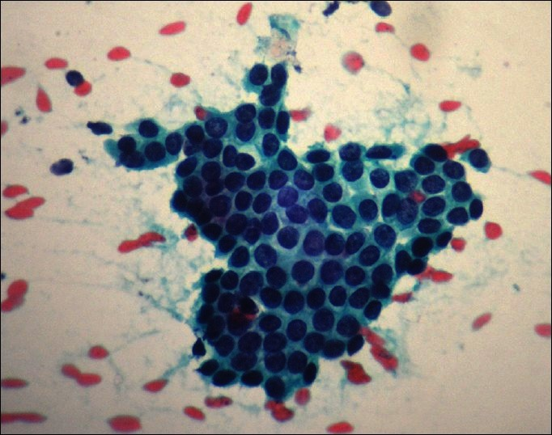
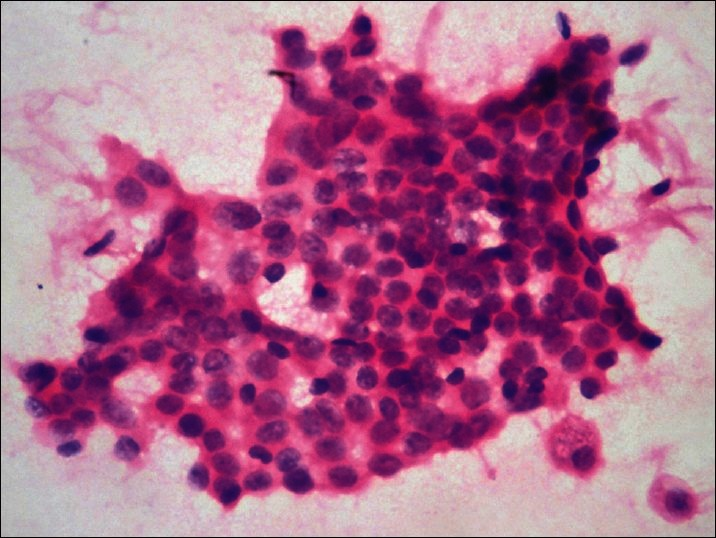
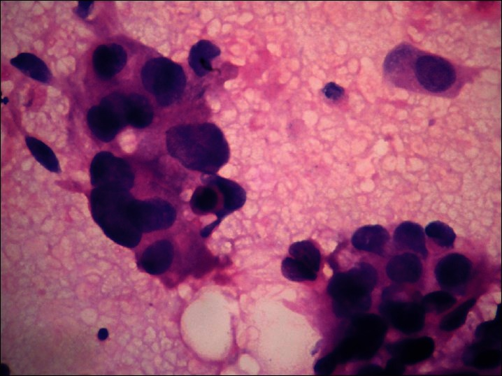

---
title: "Non-invasive Prediction Models for Malignant Breast Tumor"
author: "Olivia Fan, Alicia Gong"
date: "`r format(Sys.time(), '%d %B, %Y')`"
bibliography: references.bib
link-citations: true
output:
  pdf_document: default
  html_document:
    df_print: paged
---

```{r setup, message=F, warning=F, echo=F}
library(knitr)
library(dplyr)
library(tidyverse)
library(e1071)
library(randomForest)
library(caret)
library(ggplot2)
library(psych)
library(BioStatR)
```

```{r include=FALSE}
knitr::opts_chunk$set(echo = FALSE, warning = FALSE, message = FALSE)
```

# Introduction

Breast cancer is the most common cancer worldwide and the most common cancer diagnosed in the US (Mayo). Each year in the US, about 264,000 cases of breast cancer are diagnosed in women and about 2,400 in men (CDC). 

Early diagnosis of the condition is crucial to improve the survival rate and relieve suffering in patients. Breast carcinoma is one of the most common cancers occurring in the female population world-wide. Mammography is an effective X-ray imaging technology that detects breast cancer early. In clinical oncology, doctors usually perform morphimetric analysis of mammographic images. Nuclear changes occurring during these transformational steps need to be assessed objectively. Variations in nuclear structure are the morphologic hallmark of cancer diagnosis. There is a gradual shift in the nuclear parameters as the disease progresses from benign to malignant.
Nuclear size, shape, chromatin pattern, and nucleoli size and a number have all been reported to change in breast cancer.These nuclear morphometric features have been shown to predict the prognosis of the breast cancer patients.
Classically, benign or malignant breast tumors are diagnosed by radiologists' interpretation of mammograms based on morphometric parameters. However, diagnosing cancer is challenging even for the most skilled doctors. The symptoms are often shared with diseases and conditions that are unrelated to cancer, leading doctors to improperly diagnose the disease. 
According to an expansive study conducted by Dartmouth College, the University of Vermont, and the Fred Hutchinson Cancer Research Center, and published in the March 2015 issue of the Journal of American Medical Association, approximately 13% of the diagnoses missed Stage 1 breast cancer. Meanwhile, 48% failed to detect atypia hyperplasia, a precursor to breast cancer. A significant number also over-diagnosed atypia hyperplasia. 

There is, therefore, an urgent need to find new tools that can identify patients with breast cancer. Our study aims to build supervised machine-learning models to predict the diagnosis of breast cancer and understand the most important variables, to assist doctors and radiologists in accurately interpreting mammography imaging. 

We built 3 models in total: Lasso penalized logistic regression, SVM, and Random Forest. First, we used LASSO penalized logistic regression to select variables and to predict the probabilities. Then, we used the predictors selected by LASSO to build a SVM model. Finally, we build another Random Forest model as a comparison to the SVM model, also for a more straightforward interpretation.

# Data

We obtain the Breast Cancer Wisconsin (Diagnosis) Data Set from Kaggle. The dataset contains diagnosis results and features of the cell nuclei computed from a digitized image of a fine needle aspirate (FNA) of a breast mass for 568 patients. The size of the nucleus is expressed by the features radius and area. The shape is expressed by the features smoothness, concavity, compactness, concave points, symmetry, and fractal dimension. The perimeter expresses both the size and shape of the nucleus. A higher value of shape features corresponds to a less regular contour and, therefore, to a higher probability of malignancy. For each of the features the mean value, worst value (mean of the three largest values),
and standard error are computed for each image, resulting in 30 features of
568 images.

We examined an extensive list of variables in our models, and a full table of them can be found in the appendix.

# Data Processing

The original dataset contains a blank column '...33', so we dropped it. We also dropped the 'id' column, and rename several columns that contains blank space in their names. 

```{r load-data, message = FALSE, echo=F}
cancer<-read_csv("data.csv")%>%
  select(-...33)%>%
  select(-id)%>%
  rename(concave_points_mean='concave points_mean')%>%
  rename(concave_points_worst='concave points_worst')%>%
  rename(concave_points_se='concave points_se'
         )
```


In order to fit SVM on the data, we encode the `diagnosis` variable into a factor variable with level 1 and -1:

```{r, echo=F, warning=F}
cancer_binary<-cancer%>%
  mutate(diagnosis_binary=as.factor(ifelse(diagnosis=="M",1,-1)))
```

We partition the data into training and testing sets using a 70-30 percentage split(70% of the original data as the training set, and 30% as the testing set):

```{r, echo=F, warning=F}
set.seed(123)
dt = sort(sample(nrow(cancer_binary), nrow(cancer_binary)*.7))
cancer_train<-cancer_binary[dt,]
cancer_test<-cancer_binary[-dt,]
```

# Exploratory Data Analysis 

```{r, echo=F, warning=F, fig.height = 2, fig.width = 2}
options(repr.plot.width = 10, repr.plot.height = 5)
ggplot(data = cancer, mapping = aes(x = diagnosis)) +
  geom_bar()
```

The bar plot shows that there is a larger number of benign than malignant cancer. 

We divide the data into 3 categories according to their features.
```{r, echo=F, warning=F}
features_mean= cancer[2:11]
features_se= cancer[12:21]
features_worst= cancer[22:31]
```

```{r, echo=F, warning=F, fig.height = 4, fig.width = 4}
library(corrplot)
corrplot(cor(features_mean))
```

Major observations: 

- Radius_mean, perimeter_mean, and area_mean are highly correlated.

- Compactness_mean, concavity_mean and concave_points_mean are highly correlated.


```{r, echo=F, warning=F, fig.height = 10, fig.width = 10}
panel.hist <- function(x, ...)
{
    usr <- par("usr"); on.exit(par(usr))
    par(usr = c(usr[1:2], 0, 1.5) )
    h <- hist(x, plot = FALSE)
    breaks <- h$breaks; nB <- length(breaks)
    y <- h$counts; y <- y/max(y)
    rect(breaks[-nB], 0, breaks[-1], y, color = "dodgerblue3", ...)
}

pairs(cancer[2:11], 
             method = "pearson", # correlation method
             digits=3,
             pch = '.',
             col=ifelse(cancer$diagnosis=="M", "red", "blue"),
             density = TRUE,  # show density plots
             ellipses = TRUE, # show correlation ellipses
             diag.panel =  panel.hist
             )
```

We observe from the pairwise scatterplot matrix above that the two classifications seem to be generally separable, with distinct regions in the visualization that cleanly cluster without much mingling or mixing. Overall across malignant and benign tumors, there seems to be a strong positive linear relationship between `radius_mean` and `parameter_mean`, `radius_mean` and `area_mean`, as well as `area_mean` and `parameter_mean`, which hints again at the collinearity issue which we will later tackle at through variable selection. While the two classifications together constitute a roughly linear relationship between predictors, malignant tumors (red) generally associate with higher values in both predictors accumulating in the right top corner, while benign tumors (blue) generally associate with lower ones in the left bottom corner.

We observe that there does not seem to be a separating hyperplane for the two classes for predictors in the relationship between `texture_mean` and `symmetry_mean`, and between `smoothness_mean` and  `fractal_dimension_mean` since the observations in two classes mingle together. This hints at the fact that these predictors might not be helpful for the two class classification problem, which we will filter out in our model through variable selection.

The distributions of the predictors seem to be all unimodal, with no apparent outliers and generally right-skewed, with `concavity_mean` and `concave_points_mean` being particularly right-skewed, hinting at the high correlation between the two predictors. Hence we want to consider including only one of them in our model. We take a closer look at the distributions of these two predictors here:

```{r, warning = F, echo=F, fig.height = 2, fig.width = 5}
library(cowplot)
p1<-ggplot(cancer, aes(x=concavity_mean)) + labs(title = "Distribution of concavity mean")+
  geom_histogram()
p2<-ggplot(cancer, aes(x=concave_points_mean)) + labs(title = "Distribution of concavity point mean")+
  geom_histogram()
plot_grid(p1, p2, labels = "AUTO")
```

After deriving the histogram comparing distributions of predictors based on the two classifications, we would like to find features with little overlap between benign and malignant classes which will likely to be significant for diagnosis.
We plot the distribution of the predictors separated by the benigh and malignant classes, and observe again that predictors associated with texture, smoothness, symmetry and fractal dimension are inseparable and therefore might not be helpful for the classification problem. For example, the distributions of `smoothness_se`  for benign and malignant cancers almost completely overlap, same do `symmetry_se`, `fractal_dimension_se` and `texture_se`. Therefore, we will consider filter out these predictors in our final model.

```{r, echo=F, warning=F, fig.height = 15, fig.width = 25}
source("Functions.R")
# Read data
df = read.csv('data.csv')
# Identify the outcome and features
outcomes = c("diagnosis")
features = names(df)[3:(ncol(df)-1)]
# Keep outcome and features only
df = df[, c(outcomes, features)]
# The outcome is a dichotomous variable. Convert to `factor` to reflect this. Make 'Benign' the first (reference) level.
df$diagnosis = factor(df$diagnosis, levels = c('B', 'M'))
# options(repr.plot.width = 20, repr.plot.height = 15)
plot_data(df, 'diagnosis')
```

# Methodology 

## Model 1: LASSO-Penalized Logistic Regression

We decided to use a LASSO-penalized logistic regression model to perform variable selection by gauging insights into which predictors are the most contributive, since less significant variables are forced to be exactly zero, and the most significant variables are kept in the final model. Also because LASSO is a great tool dealing with multicollinearity issue. Since our EDA shows that many of the input variables are correlated, LASSO will drop the highly correlated features.

As explained in our exploratory data analysis above, we filter out predictors associated with texture, smoothness, fractal dimension and symmetry in our model due to the lack of separation in the values of these predictors for the benign and malignant tumor classes.

### Hyperparameter Tuning

We fitted the LASSO-penalized logistic regression model using the optimal hyperparameter $\lambda= 0.0026830$ via cross validation. To explore the interaction between symmetry and the mean for number of concave portions of the contour, we included the interaction term `symmetry_worst*concave_points_mean`.

```{r, warning = F, echo=F}
# Dumy code categorical predictor variables
x <- model.matrix(diagnosis~.-diagnosis_binary-texture_mean-smoothness_mean-symmetry_mean-fractal_dimension_mean-texture_se-smoothness_se-symmetry_se-fractal_dimension_se-texture_worst-smoothness_worst-symmetry_worst-symmetry_worst-fractal_dimension_worst+compactness_mean*concave_points_mean, cancer_train)[,-1]
# Convert the outcome (class) to a numerical variable
y <- ifelse(cancer_train$diagnosis == "M", 1, 0)
```

```{r, echo=F, warning=F, fig.height = 4, fig.width = 4}
library(glmnet)
# Find the best lambda using cross-validation
set.seed(123)
cv.lasso <- cv.glmnet(x, y, alpha = 1, family = "binomial")
plot(cv.lasso)
```

```{r, warning = F, echo=F}
cv.lasso$lambda.min
# Final model with lambda.min
lasso.model <- glmnet(x, y, alpha = 1, family = "binomial",
                      lambda = cv.lasso$lambda.min)
df<-as.data.frame(as.matrix(coef(lasso.model)))
df%>%filter(s0!=0)%>%rename("coefficient"=s0)%>%kable(digits=4)
```

### Logistic Model

\begin{align} \log(\frac{P}{1-P}) &= -10.4871-0.1130 \times radius\_mean -33.6480 \times compactness\_mean \\&+14.3918 \times concavity\_mean +19.0997 \times concave\_points\_mean \\ &+ 0.0944 \times area\_se -30.3992 \times compactness\_se -31.2549 \times concavity\_se \\ & +34.8557 \times concave\_points\_se +0.0112 \times radius\_worst +0.0049 \times area\_worst \\ &+4.9213 \times  compactness\_worst +7.6360 \times concavity\_worst + 26.8649 \times concave\_points\_worst \\ &+74.5208 \times compactness\_mean \times concave\_points\_mean \end{align}

### Prediction

Using the logistic regression model, besides classification we also want to understand uncertainty - more specifically, predictive probabilities that a tumor is benign or malignant given the values of the predictors:

```{r}
# Make predictions on the test data
x.test <- model.matrix(diagnosis~.-diagnosis_binary-texture_mean-smoothness_mean-symmetry_mean-fractal_dimension_mean-texture_se-smoothness_se-symmetry_se-fractal_dimension_se-texture_worst-smoothness_worst-symmetry_worst-symmetry_worst-fractal_dimension_worst+compactness_mean*concave_points_mean, cancer_test)[,-1]
probabilities <- lasso.model %>% predict(newx = x.test, type = "response")
predicted.classes <- ifelse(probabilities > 0.5, "M", "B")

#Present the prediction
predictors<-cancer_test%>%select(concave_points_mean,area_se,compactness_se,radius_worst,concavity_worst,concave_points_worst,compactness_mean,compactness_se,concavity_se,concavity_mean,radius_mean,concave_points_se,area_worst,compactness_worst)
predicted_results<-cbind(predictors,probabilities)%>%
  rename(probabilities=s0)
predicted_results<-cbind(predicted_results,predicted.classes)%>%
  rename("predicted_class"=s0)
predicted_results%>%head(10)%>%kable(digits=3)
# Model accuracy
observed.classes <- cancer_test$diagnosis
mean(predicted.classes == observed.classes)
```

We achieved a prediction accuracy of 0.9883. To interpret the predictions, we see that a patient with tumor with `texture_mean` of 10.38, `concave_points_mean` of 0.147, `radius_se` of 1.095, `texture_se` of 0.905, `area_se` of 153.400, `smoothness_se` of 0.006, `compactness_se` of 0.049, `fractal_dimension_se` of 0.006, `radius_worst` of 25.380, `texture_worst` of 17.33, `smoothness_worst` of 0.162, `concavity_worst` of 0.712, `concave_points_worst` of 0.265, `symmetry_worst` of 0.460 is expected to have a 100% of being diagnosed as malignant tumor. 
Whereas... is expected to have a 0% of being diagnosed as malignant tumor. 
Whereas... is expected to have a 87.4% of being diagnosed as malignant tumor. 

### Model Interpretation

```{r, echo=F, warning=F, fig.height = 3, fig.width = 4}
summary(cancer_train$compactness_mean)
summary(cancer_train$concave_points_mean)

df <- data.frame()
cancer_test_low = cancer_test%>%select(-compactness_mean,-concave_points_mean)
duprow=cancer_test_low[1,]
for(i in 1:150)
{
    df = rbind(df,duprow)
}
concave_points_mean = seq(0,0.2,length.out=150)
df$compactness_mean=0.01938
df <- cbind(df,concave_points_mean)
df<- df%>%mutate(logit = -10.4871-0.1130*radius_mean-33.6480*compactness_mean+14.3918*concavity_mean+19.0997*concave_points_mean+0.0944*area_se-30.3992*compactness_se -31.2549*concavity_se +34.8557 *concave_points_se +0.0112*radius_worst+0.0049*area_worst+4.9213*compactness_worst+7.6360*concavity_worst + 26.8649*concave_points_worst+74.5208*compactness_mean*concave_points_mean)
df$compactness_mean_level = "low"

## MEDIUM VALUE OF compactness_mean
df2 <- data.frame()
cancer_test_low = cancer_test%>%select(-compactness_mean,-concave_points_mean)
duprow=cancer_test_low[1,]
for(i in 1:150)
{
    df2 = rbind(df2,duprow)
}
concave_points_mean = seq(0,0.2,length.out=150)
df2$compactness_mean=0.26
df2 <- cbind(df2,concave_points_mean)
df2<- df2%>%mutate(logit = -10.4871-0.1130*radius_mean-33.6480*compactness_mean+14.3918*concavity_mean+19.0997*concave_points_mean+0.0944*area_se-30.3992*compactness_se -31.2549*concavity_se +34.8557 *concave_points_se +0.0112*radius_worst+0.0049*area_worst+4.9213*compactness_worst+7.6360*concavity_worst + 26.8649*concave_points_worst+74.5208*compactness_mean*concave_points_mean)
df2$compactness_mean_level = "medium"

df_combined<-rbind(df,df2)

## HIGH VALUE OF compactness_mean
df3 <- data.frame()
cancer_test_low = cancer_test%>%select(-compactness_mean,-concave_points_mean)
duprow=cancer_test_low[1,]
for(i in 1:150)
{
    df3 = rbind(df3,duprow)
}
concave_points_mean = seq(0,0.2,length.out=150)
df3$compactness_mean=0.28670
df3 <- cbind(df3,concave_points_mean)
df3<- df3%>%mutate(logit = -10.4871-0.1130*radius_mean-33.6480*compactness_mean+14.3918*concavity_mean+19.0997*concave_points_mean+0.0944*area_se-30.3992*compactness_se -31.2549*concavity_se +34.8557 *concave_points_se +0.0112*radius_worst+0.0049*area_worst+4.9213*compactness_worst+7.6360*concavity_worst + 26.8649*concave_points_worst+74.5208*compactness_mean*concave_points_mean)
df3$compactness_mean_level = "high"

df_combined<-rbind(df_combined,df3)

## FUNCTION TO GET THE Probability

get_probability<-function(log_odds){
  odds=exp(log_odds)
  odds/(1+odds)
}

## get probability
df_combined<-df_combined%>%
  rowwise()%>%
  mutate(probability = get_probability(logit))

ggplot(df_combined, aes(x=concave_points_mean, y=probability, color=compactness_mean_level, shape=compactness_mean_level)) +labs(title = "Interaction between concave points mean and compactness mean", x = "Concave Points Mean")+
  geom_point() + 
  geom_smooth(method = "glm", 
    method.args = list(family = "binomial"), 
    se = FALSE) 
```

## Model 2: SVM

### Linear Kernel SVM

We use the predictors selected by the LASSO penalized logistic regression as predictors for the support vector machine model:

If two predictors have high correlation, we only use one of them:

```{r}
set.seed(321)
tune.out <- tune(svm, diagnosis_binary ~concave_points_mean+area_se+compactness_se+radius_worst+concavity_worst+concave_points_worst+compactness_mean+compactness_se+concavity_se+concavity_mean+radius_mean+concave_points_se+area_worst+compactness_worst+compactness_mean*concave_points_mean, data = cancer_train, kernel = "linear",
                 ranges = list(cost = c(0.001, 0.01, 0.1,
                                        1, 5, 10, 100)))
summary(tune.out)
best_linear_svm <- tune.out$best.model
summary(best_linear_svm)
```

```{r, echo=F}
devtools::install_github("yihui/printr")
require(printr)
ypred <- predict(best_linear_svm, cancer_test)
table(predict = ypred, truth = cancer_test$diagnosis_binary)
classification_error <- 1- sum(ypred == cancer_test$diagnosis_binary)/length(ypred)
classification_error
```

The misclassification rate is 0.02924.


### Radial Kernel SVM

```{r}
set.seed(5)
tune.out <- tune(svm, diagnosis_binary ~ concave_points_mean+area_se+compactness_se+radius_worst+concavity_worst+concave_points_worst+compactness_mean+compactness_se+concavity_se+concavity_mean+radius_mean+concave_points_se+area_worst+compactness_worst+compactness_mean*concave_points_mean, data = cancer_train,
                 kernel = "radial",
                 ranges = list(cost = c(0.1, 1, 10, 100, 1000),
                               gamma = c(0.5, 1, 2, 3, 4)))
summary(tune.out)
best_radial_svm <- tune.out$best.model
summary(best_radial_svm)
```


```{r}
ypred <- predict(best_radial_svm, cancer_test)
table(predict = ypred, truth = cancer_test$diagnosis_binary)
classification_error <- 1- sum(ypred == cancer_test$diagnosis_binary)/length(ypred)
classification_error
```

The misclassification rate is 0.02924, which is similar to that of the linear kernel which suggests that the two classes are likely to be linearly separable so that we can find a separating hyperplane using the linear kernel.


### SVM Visualization

### Linear


```{r, echo=F, warning=F, fig.height = 3, fig.width = 4}
tune.out <- tune(svm, diagnosis_binary ~ concavity_mean+radius_se+texture_se+smoothness_se, data = cancer_train, kernel = "linear",
                 ranges = list(cost = c(0.001, 0.01, 0.1,
                                        1, 5, 10, 100)))
best_linear_graph <- tune.out$best.model

plot(best_linear_graph, cancer_train, radius_se~concavity_mean)

plot(best_linear_graph, cancer_train, texture_se~concavity_mean)
```


### Radial

```{r, echo=F, warning=F, fig.height = 3, fig.width = 4}
tune.out <- tune(svm, diagnosis_binary ~ concavity_mean+radius_se+texture_se+smoothness_se,
                 kernel = "radial", data = cancer_train,
                 ranges = list(cost = c(0.1, 1, 10, 100, 1000),
                               gamma = c(0.5, 1, 2, 3, 4)))
best_radial_graph <- tune.out$best.model

plot(best_radial_graph, cancer_train, texture_se~concavity_mean)
plot(best_radial_graph, cancer_train, concavity_mean~texture_se)
```


### ROC (Linear SVM)

We visualize the ROC curves:

On train data: 

```{r, echo=F, warning=F, fig.height = 4, fig.width = 5}
library(pROC)
fitted <- attributes(predict(best_linear_svm, cancer_train,
                             decision.values=TRUE))$decision.values
ROC_svm1 <- roc(cancer_train$diagnosis_binary, fitted)

fitted <- attributes(predict(best_radial_svm, cancer_train,
                             decision.values=TRUE))$decision.values
ROC_svm2 <- roc(cancer_train$diagnosis_binary, fitted)
plot(ROC_svm1, col = "blue")
lines(ROC_svm2, col = "red")
legend("bottomright", legend = c("Linear", "Radial"), 
       col = c("blue", "red"), lty = 1)
```

On test data: 

```{r, echo=F, warning=F, fig.height = 4, fig.width = 5}
fitted <- attributes(predict(best_linear_svm, cancer_test,
                             decision.values=TRUE))$decision.values
ROC_svm1 <- roc(cancer_test$diagnosis_binary, fitted)

fitted <- attributes(predict(best_radial_svm, cancer_test,
                             decision.values=TRUE))$decision.values
ROC_svm2 <- roc(cancer_test$diagnosis_binary, fitted)
plot(ROC_svm1, col = "blue")
lines(ROC_svm2, col = "red")
legend("bottomright", legend = c("Linear", "Radial"), 
       col = c("blue", "red"), lty = 1)
```

Even though the radial kernel fits the training data more closely due to its higher complexity, the linear kernel performs better on the test data (since the data is likely to be linearly separable as explained above), we decided to select the model with the linear kernel.

## Model 3: Random Forest

Now, we are going to build a Random Forest model to compare with Lasso and SVM. We chose Random Forest because it uses bootstrap sampling and feature sampling, so it is not affected by multicollinearity that much since it is picking different set of features for different models and of course every model sees a different set of data points. What's more, it is easy and straightforward to interpret a tree model, so it can help us understanding the importance of the variables than LASSO.

First, We select variables by running a preliminary random forest model with all the variables, to rank their importance. 

```{r}
rf <- randomForest(diagnosis_binary~.-diagnosis, data=cancer_train, proximity=TRUE)
importance(rf)
```

After testing different variables based on their important, and taking into accounts the collinearity issue we discussed in the EDA section, we decided to select the following variables as the predictors:
concave_points_worst, area_worst, perimeter_worst, radius_worst, concave_points_mean, perimeter_mean, concavity_worst, area_se.

We chose mtry=2, because after tuning mtry, we found that mtry=2 has the lowest OOB error.

```{r}
set.seed(123)
rf_predictors <- cancer_train %>% select(concave_points_worst, area_worst, perimeter_worst, radius_worst, concave_points_mean, perimeter_mean, concavity_worst, area_se)
mtry <- tuneRF(rf_predictors, cancer_train$diagnosis_binary, ntreeTry=500,
               stepFactor=1.5,improve=0.01, trace=TRUE, plot=TRUE, doBest = TRUE)
```

We chose the number of tree to be 500. The number of trees should be chosen carefully, since a high performance of the individual models might lead to overfitting when the number of trees is very high. However, taking 50 trees caused a lower accuracy than taking 500 trees. Therefore, this higher number
of trees is chosen. 

```{r}
set.seed(123)
rf_mix <- randomForest(diagnosis_binary~concave_points_worst+area_worst+perimeter_worst+radius_worst+concave_points_mean+perimeter_mean+concavity_worst+area_se, data = cancer_train, proximity=TRUE, mtry=2)
print(rf_mix)
```
```{r}
pred_mix <- predict(rf_mix, cancer_test)
confusionMatrix(pred_mix, cancer_test$diagnosis_binary)
```
The RF model yields a 96% accuracy for the testing set. 

```{r, echo=F, warning=F, fig.height = 4, fig.width = 5}
ImpDatamix <- as.data.frame(importance(rf_mix))
ImpDatamix$Var.Names <- row.names(ImpDatamix)

ggplot(ImpDatamix, aes(x=Var.Names, y= MeanDecreaseGini)) +
  geom_segment(aes(x=Var.Names, xend=Var.Names, y=0, yend=MeanDecreaseGini), color="skyblue") +
  theme_light() +
  coord_flip() +
  theme(
    legend.position="bottom",
    panel.grid.major.y = element_blank(),
    panel.border = element_blank(),
    axis.ticks.y = element_blank()
  )
```

From the plot we can see that the most important predictors are: concave_points_worst, concave_points_mean, area_worst, perimeter_worst, and radius_worst. Interestingly, perimeter_worst has high gini coefficient, but perimeter_mean ranks second from the last.

# Conclusion

The result of the LASSO model shows that radius, compactness, concavity, and concave points are the most important variables. The result of the RF model suggest that radius, perimeter, area, and concave points are the most important variables. 

Concave points counted the number of concave portions of the contour of the cell nucleus.
Radius computed by averaging the length of radial line segments from the center of the nuclear mass to each of the points of the nuclear border.
Nuclear area was the area within the outlined nuclear perimeter.
Perimeter was measured as the distance around the nuclear border.
Compactness of the cell nuclei calculated using the formula: Perimeter^2 /area. 

Both of the models highlights concave points as the most crucial variable. Concavity is the severity of concave portions of the contour. A high concavity means that the boundary of the cell nucleus has indentations, and thus is rather rough than smooth. If the contour contains one real cell, the added concave point separates one cell into two parts. Therefore, the higher number the concave points, the more irregular the shape is. 

The following two pictures shows the cytological features for benigh Fibroadenoma and Fibrocystic disease. When the tumor is benign, the cells shows mild variation in size and shape. 



However, when the cancer is malignant carcinoma, we can observe loosely arranged clusters of ductal epithelial cells showing nuclear pleomorphism, increased nuclear cytoplasmic ratio, nuclear indentations, and hyperchromatic nucleus.


Our results is correspondent with the clinical evidence. The ductal carcinoma cells showed higher values for nuclear area, perimeter, diameter, compactness, and concave points when compared to fibroadenomas, fibrocystic disease, and hyperplasia.

When applying these 3 models to the test set, the LASSO-Penalized Logistic model yields an accuracy of 98.8%; both linear and Radial SVM model yields an accuracy around 97%, and the Random Forest model has an accuracy of 96%. LASSO has the highest accuracy in prediction. On the other hand, RF models use fewer predictors, but it gives a more intuitive result.

One limitation of our study is that although there are 30 variables, there are only 3 categories (mean, se, worst), and many of them are highly correlated. In future works, it would be interesting to see if other exogenous variables such as the patients' age, sex, and health conditions have potential effects in the accuracy of breast cancer diagnosis. 

# Citations

Wolberg WH, Street WN, Mangasarian OL. Importance of nuclear morphology in breast cancer prognosis. Clin Cancer Res. 1999;5:3542–8.

# Appendix

